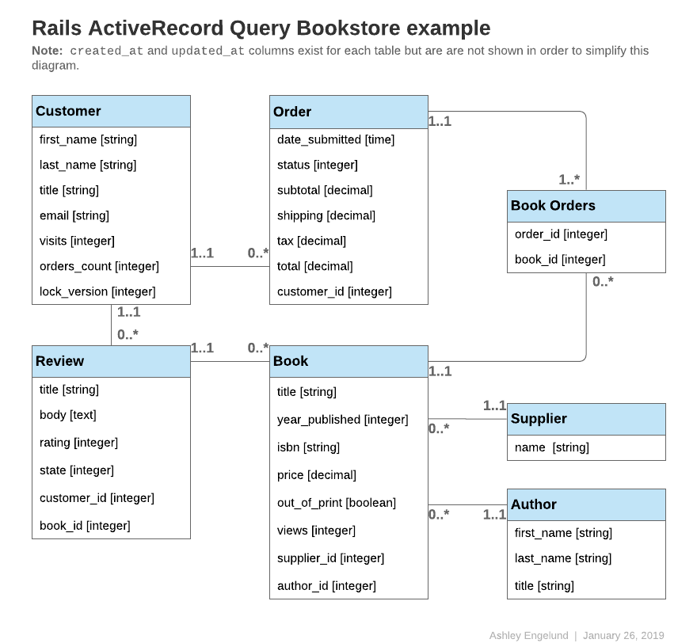

# Rails ActiveRecord Query Bookstore example

This project contains the Bookstore database schema mentioned in [Rails guides](https://guides.rubyonrails.org/active_record_querying.html).



## Generate models

```
rails g model author first_name:string last_name:string title:string
rails g model supplier name:string
rails g model book title:string year_published:integer isbn:string price:decimal views:integer author:references supplier:references

rails g model customer first_name:string last_name:string title:string email:string visits:integer orders_count:integer lock_version:integer

rails g model review title:string body:text rating:integer state:integer customer:references book:references

rails g model order date_submitted:timestamp status:integer subtotal:decimal shipping:decimal tax:decimal total:decimal customer:references

rails g migration CreateJoinTableBookOrder book order
```
